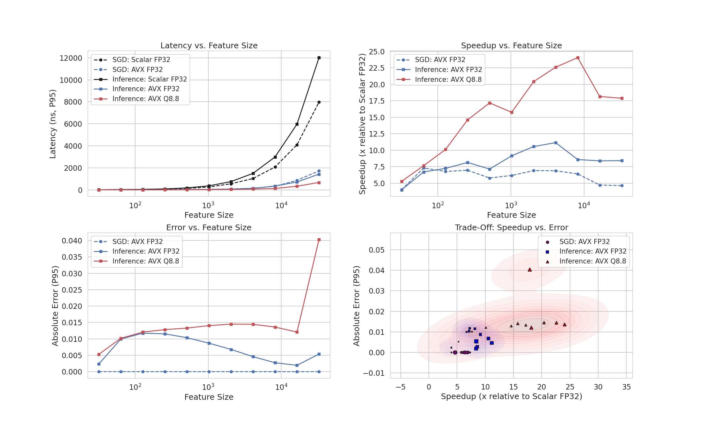

## AVX-LR
AVX-LR is my [AVX2-optimized](https://en.wikipedia.org/wiki/Advanced_Vector_Extensions) logistic regression model designed for low-latency inference and updates. Implementing [Q8.8 quantization](https://en.wikipedia.org/wiki/Q_(number_format)), vectorized operations, and a precomputed sigmoid LUT to achieve nanosecond-scale performance.

**This benchmark measures**:  
- **Inference latency** (*forward pass*)  
- **SGD update latency** (*backward pass*)  
- **Speedup** (*vs. scalar FP32 (naive)*)  
- **Error** (*absolute difference*)

Unlike the naive scalar approach, AVX-LR maintains sub-microsecond performance even at large feature sizes, achieving up to **24.06× speedup**.

---

## x86-64 Linux - Intel Core i7 14700k (3.4 GHz) | Micro-benchmark

> **Note:** The 95th percentile (**P95**) represents the worst-case latency for 95% of inference runs. Each individual run is averaged over multiple executions to minimize measurement overhead.

### Latency Comparison (P95)

  <table>
    <tr>
      <th rowspan="2">Feature Size</th>
      <th colspan="3">Inference Benchmark</th>
      <th colspan="2">SGD Benchmark</th>
    </tr>
    <tr>
      <th>Scalar FP32</th>
      <th>AVX FP32</th>
      <th>AVX Q8.8</th>
      <th>Scalar FP32</th>
      <th>AVX FP32</th>
    </tr>
    <tr>
      <td><strong>32</strong></td>
      <td>10.48 ns</td>
      <td>2.63 ns <small>(3.98×)</small></td>
      <td><strong>1.99 ns</strong> <small>(5.27×)</small></td>
      <td>8.53 ns</td>
      <td><strong>2.14 ns</strong> <small>(3.99×)</small></td>
    </tr>
    <tr>
      <td><strong>64</strong></td>
      <td>23.14 ns</td>
      <td>3.46 ns <small>(6.69×)</small></td>
      <td><strong>3.03 ns</strong> <small>(7.64×)</small></td>
      <td>22.52 ns</td>
      <td><strong>3.09 ns</strong> <small>(7.29×)</small></td>
    </tr>
    <tr>
      <td><strong>512</strong></td>
      <td>178.64 ns</td>
      <td>25.06 ns <small>(7.13×)</small></td>
      <td><strong>10.40 ns</strong> <small>(17.18×)</small></td>
      <td>133.28 ns</td>
      <td><strong>23.06 ns</strong> <small>(5.78×)</small></td>
    </tr>
    <tr>
      <td><strong>2048</strong></td>
      <td>749.78 ns</td>
      <td>71.05 ns <small>(10.55×)</small></td>
      <td><strong>36.73 ns</strong> <small>(20.41×)</small></td>
      <td>553.49 ns</td>
      <td><strong>80.25 ns</strong> <small>(6.90×)</small></td>
    </tr>
    <tr>
      <td><strong>8192</strong></td>
      <td>2.99 µs</td>
      <td>348.27 ns <small>(8.58×)</small></td>
      <td><strong>124.17 ns</strong> <small>(24.06×)</small></td>
      <td>2.07 µs</td>
      <td><strong>323.90 ns</strong> <small>(6.40×)</small></td>
    </tr>
    <tr>
      <td><strong>32768</strong></td>
      <td>12.02 µs</td>
      <td>1.43 µs <small>(8.41×)</small></td>
      <td><strong>672.17 ns</strong> <small>(17.88×)</small></td>
      <td>7.97 µs</td>
      <td><strong>1.72 µs</strong> <small>(4.62×)</small></td>
    </tr>
  </table>

### Performance Dashboard
**Top Left: *Latency (P95) vs. Feature Size***- Latency (ns) for Scalar FP32, AVX FP32, and AVX Q8.8.

**Top Right: *Speedup vs. Feature Size***- Speedup relative to Scalar FP32 achieved by AVX FP32 and AVX Q8.8.

**Bottom Left: *Error (P95) vs. Feature Size***- Asolute error of the different implementations.

**Bottom Right: *Speedup vs. Error***- Relationship between performance and error.

  

---
> **Notes:**   
> The Feature Size is on a log scale.  
> For the Error benchmark, each run is executed only once to prevent error accumulation.