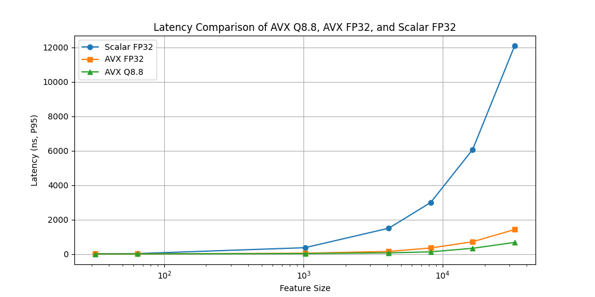

### **AVX Q8.8 vs. AVX FP32 vs. Scalar FP32 - Performance Summary**
#### **GNU/Linux Ubuntu: Intel Core i7 14700k 3.4 GHz | Logistic Regression Inference Benchmark**
> [!NOTE]  **P95** (95th percentile) represents the **worst-case** for 95% of the observed inference runs.

#### **Speedup Comparison (P95)**
| Feature Size | AVX Q8.8 vs. Scalar | AVX FP32 vs. Scalar | AVX Q8.8 vs. AVX FP32 |
|-----------------|---------------------------------|--------------------------------|--------------------------------|
| 32  | 2.18x  | 1.85x  | 1.18x  |
| 64  | 2.56x  | 2.00x  | 1.29x  |
| 1024  | 11.56x  | 7.15x  | 1.62x  |
| 4096  | 13.90x  | 6.18x  |  **2.25x**  |
| 8192  | 15.27x  | 7.94x  | 1.92x  |
| 16384  | 16.43x  | 8.38x  | 1.96x  |
| 32768  |  **16.64x**    |   **8.38x**   | 1.99x  |

---

#### **Latency Comparison (P95)**
| **Feature Size** | Scalar FP32 | AVX FP32 | AVX Q8.8 |
|-----------------|-----------------|----------------|----------------|
| 32  | 48 ns  |    **26 ns**   |    **22 ns**   |
| 64  |    **44 ns**   | 22 ns  | 17 ns  |
| 1024  | 393 ns  | 55 ns  | 34 ns |
| 4096  |    **1.52 µs**   | 245 ns  | 111 ns  |
| 8192  | 3.01 µs  | 379 ns  | 197 ns  |
| 16384  | 6.10 µs  | 728 ns  | 371 ns  |
| 32768  | 12.10 µs  |    **1.44 µs**   | 727 ns |

---

#### **Absolute Error Comparison (P95)**
| **Feature Size** | **AVX Q8.8 vs. Scalar** | AVX FP32 vs. Scalar |
|-----------------|----------------------------------|----------------------------------|
| 32  |    **5.36e-3**  | 2.38e-3  |
| 64  | 1.01e-2  |    **9.84e-3**   |
| 1024  | 1.40e-2  | 8.79e-3  |
| 4096  | 1.44e-2 | 4.65e-3  |
| 8192  | 1.34e-2  | 2.72e-3 |
| 16384  | 1.20e-2  |    **1.91e-3**   |
| 32768  |    **3.95e-2**  | 5.32e-3  |

