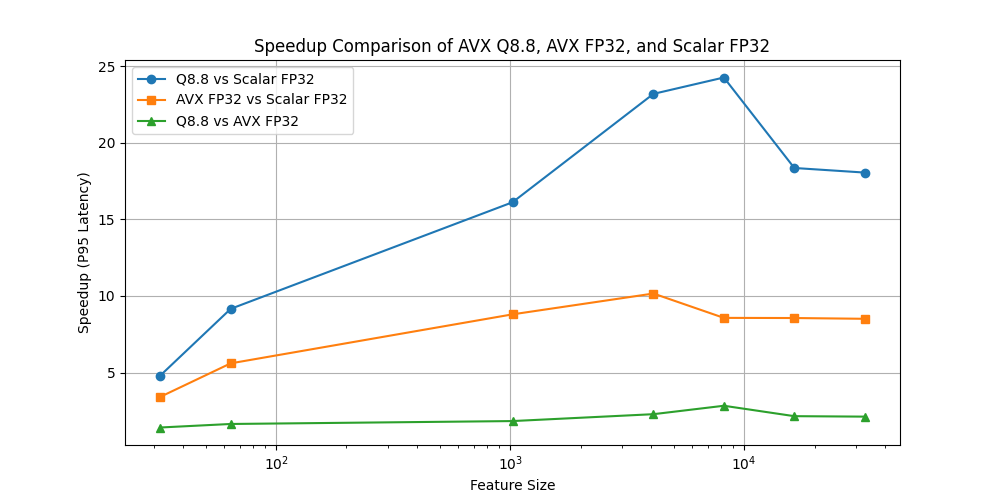

### **AVX Q8.8 vs. AVX FP32 vs. Scalar FP32 - Performance Summary**
#### x86-64 Linux - Intel Core i7 14700k ( 3.4 GHz ) | Inference Benchmark
> **Note**: The 95th percentile (**P95**) represents the worst-case latency for 95% of 1 million inference runs, where each individual run is averaged over 100 executions to minimize measurement overhead.

#### **Latency Comparison (P95)**
| **Feature Size** | Scalar FP32 | AVX FP32 | AVX Q8.8 |
|-----------------|-----------------|----------------|----------------|
| 32  |  **10.46 ns**   |  **3.07 ns**   |    **2.18 ns**  |
| 64  |  23.18 ns | 4.14 ns | 2.53 ns |
| 1024  | 364.64 ns  | 41.45 ns  | 22.62 ns |
| 4096  |    **1.49 µs**   | 147.14 ns  | 64.42 ns  |
| 8192  | 2.99 µs  | 348.55 ns  | 123.15 ns  |
| 16384  | 6.06 µs  | 707.94 ns  | 330.01 ns  |
| 32768  | 12.07 µs  |    **1.42 µs**   | 668.44 ns |

---

#### **Speedup Comparison (P95)**
| Feature Size | AVX Q8.8 vs. Scalar | AVX FP32 vs. Scalar | AVX Q8.8 vs. AVX FP32 |
|-----------------|---------------------------------|--------------------------------|--------------------------------|
| 32  | 4.8x  | 3.41x  | 1.41x  |
| 64  | 9.16x  | 5.6x  | 1.64x  |
| 1024  | 16.12x  | 8.8x  | 1.83x  |
| 4096  | 23.2x  |  **10.16x**  | 2.28x |
| 8192  |  **24.27x**   | 8.57x  |  **2.83x** |
| 16384  | 18.36x  | 8.56x  | 2.15x  |
| 32768  | 18.06x | 8.51x  | 2.12x  |

---
>**Note**: Here each inference run is executed only once to prevent error accumulation.

#### **Absolute Error Comparison (P95)**
| **Feature Size** | **AVX Q8.8 vs. Scalar** | AVX FP32 vs. Scalar |
|-----------------|----------------------------------|----------------------------------|
| 32  |  5.36e-3 | 2.38e-3  |
| 64  | 1.01e-2  |    **9.84e-3**   |
| 1024  | 1.40e-2  | 8.79e-3  |
| 4096  | 1.44e-2 | 4.65e-3  |
| 8192  | 1.34e-2  | 2.72e-3 |
| 16384  | 1.20e-2  | 1.91e-3 |
| 32768  |    **3.95e-2**  | 5.32e-3  |

